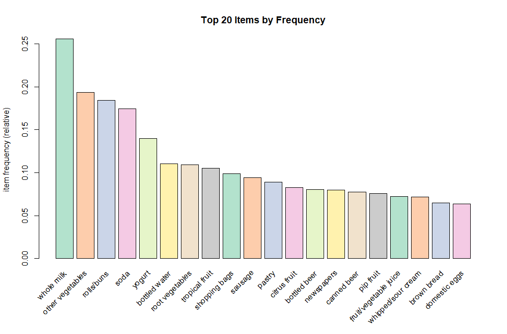

Here’s an updated and detailed version of the `README.md` file based on your project's output:

---

# Groceries Market Basket Analysis Using Association Rules

This project applies market basket analysis techniques to the **Groceries dataset** to uncover associations between items frequently purchased together. Using the Apriori algorithm, association rules were generated and analyzed to provide actionable insights for optimizing product placement, promotions, and marketing strategies.

---

## Key Features

### 1. **Association Rule Mining**
- Utilized the **Apriori algorithm** to uncover relationships between items.
- Generated **232 association rules** with a minimum support threshold of 0.01 and a confidence threshold of 0.2.

### 2. **Frequent Item Analysis**
- Identified the top 20 most frequently purchased items using an **item frequency plot**.
- Key products like "whole milk" and "other vegetables" emerged as highly purchased items.

### 3. **Lift Value Visualization**
- Generated a **box plot of lift values** to analyze the strength of associations between items.
- High lift values highlight strong complementary relationships, such as `{onions} => {other vegetables}`.

### 4. **Actionable Recommendations**
- Group complementary items together in stores to encourage cross-selling.
- Offer discounts on products frequently purchased together.
- Optimize marketing campaigns using high-lift item combinations.

---

## Dataset Overview

- **Name**: Groceries
- **Transactions**: 9,835
- **Items**: 169

---

## Analysis Results

### Association Rules
The following are examples of the association rules generated:
| Rule                       | Support   | Confidence | Lift    |
|----------------------------|-----------|------------|---------|
| {} => {whole milk}         | 25.55%    | 25.55%     | 1.00    |
| {onions} => {other vegetables} | 1.42% | 45.90%     | 2.37    |
| {berries} => {yogurt}      | 1.05%     | 31.80%     | 2.28    |

### Frequent Items
- The **item frequency plot** visualizes the top 20 items by purchase frequency, emphasizing staples like "whole milk," "other vegetables," and "yogurt."

### Lift Values
- The **box plot of lift values** demonstrates the strength of associations between items. High lift values suggest significant relationships that can guide store layout and promotional efforts.

---

## Visualizations

### 1. **Item Frequency Plot**


### 2. **Box Plot of Lift Values**


---

## Recommendations

Based on the analysis:
1. **Product Placement**
   - Group complementary items together (e.g., "onions" and "other vegetables") to encourage joint purchases.
2. **Promotional Offers**
   - Offer discounts on products frequently bought together, such as "berries" and "yogurt."
3. **Marketing Strategy**
   - Use association rules to refine marketing campaigns, focusing on high-lift item pairs for targeted promotions.

---

## Technologies Used

- **Programming Language**: R
- **Libraries**:
  - `arules`: For association rule mining.
  - `arulesViz`: For visualizing association rules.
  - `RColorBrewer`: For enhanced color palettes in visualizations.

---

## How to Run the Code

1. **Install Required Packages**
   Ensure the following R packages are installed:
   - `arules`
   - `arulesViz`
   - `RColorBrewer`

   You can install them using:
   ```R
   install.packages(c("arules", "arulesViz", "RColorBrewer"))
   ```

2. **Run the Script**
   Execute the provided R script in your R environment. It will:
   - Load the Groceries dataset.
   - Apply the Apriori algorithm to generate association rules.
   - Visualize results with item frequency and lift value plots.

3. **Analyze Outputs**
   - Inspect the console output for rule summaries.
   - Review the visualizations saved as PNG files.

---

## Future Enhancements

- **Dynamic Filtering**: Allow users to adjust support and confidence thresholds interactively.
- **Interactive Visualizations**: Use tools like `shiny` to create dynamic dashboards.
- **Segmentation Analysis**: Analyze subsets of transactions for time-specific or region-specific patterns.

---

## License

This project is open-source and available under the [MIT License](LICENSE).

---

## Contact

**Author**: Jeremiah Ochepo  
**Email**: jochepo4growth@gmail.com  
**GitHub**: [Jeremiah Ochepo](https://github.com/ewache04)

--- 

Feel free to use or contribute to this project! If you encounter any issues or have suggestions for improvements, open an issue on the GitHub repository.