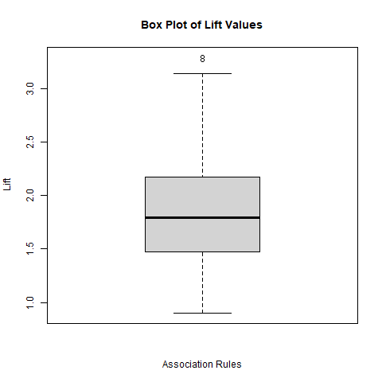

**Project Overview: Association Rule Mining with Apriori Algorithm on Groceries Dataset**

**Introduction:**  
This project demonstrates the use of the Apriori algorithm to discover association rules from the "Groceries" dataset, a transactional dataset commonly used in market basket analysis. By analyzing these associations, actionable insights are generated to improve product placement, marketing strategies, and customer engagement in retail environments.

---

**Key Steps in the Project:**  

**1. Load Required Libraries:**  
The project begins by ensuring that necessary libraries (`arules`, `arulesViz`, and `RColorBrewer`) are installed and loaded. These libraries provide tools for association rule mining and visualization.

**2. Load Dataset:**  
The "Groceries" dataset is used for this analysis. It is loaded into R if it does not already exist in the environment.

**3. Apply the Apriori Algorithm:**  
The Apriori algorithm is applied to identify association rules with:  
- Support threshold: 0.01  
- Confidence threshold: 0.2  

Generated rules are inspected to analyze their structure and properties.

**4. Rule Inspection:**  
The top 10 association rules are extracted and inspected for interpretability. These rules provide insights into item co-purchasing behaviors.

**5. Item Frequency Plot:**  
A frequency plot is generated to visualize the top 20 items purchased. This helps identify popular products in the dataset.

**6. Visualization and Insights:**  
- A box plot of lift values for association rules involving the top 20 items is created to analyze the strength of the rules.
- The visualization is saved as a file named `boxplot_lift.png`.

**7. Analysis and Recommendations:**  
The analysis concludes with actionable recommendations based on association rules, including:  
- Placing complementary products together.  
- Offering discounts on substitutable products.  
- Optimizing product placement based on identified associations.

---

**Key Outputs and Visualizations:**  
1. **Item Frequency Plot:** Highlights the most frequently purchased items in the dataset.  
2. **Box Plot of Lift Values:** Analyzes the strength of association rules, saved as `boxplot_lift.png`.  

---

**Technical Details:**  

- **Dataset:** "Groceries"  
- **Programming Language:** R  
- **Libraries Used:**  
  - `arules` for association rule mining.  
  - `arulesViz` for visualizations.  
  - `RColorBrewer` for enhancing visuals.  
- **Algorithm:** Apriori, for discovering frequent itemsets and association rules.  

---

**Recommendations for Retail Strategies:**  

- **Complementary Products:** Place items often bought together near each other to encourage joint purchases.  
- **Substitutable Products:** Offer discounts or bundle deals on substitutable items to boost sales.  
- **Product Placement:** Leverage rules with high lift values to strategically optimize product placement.  

---

**GitHub Repository:**  
The full code, outputs, and detailed documentation for this project are available at:  
[Association Rule Mining - GitHub Repository](https://github.com/ewache04/Shopping-Pattern-Detection)  

